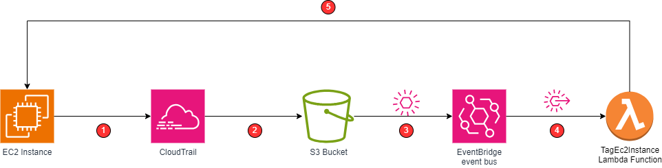

# Using Python to Automate AWS Services | Lambda and EC2 #
# NOTE: This is still WIP and not complete #
I have used the AWS automation example created by [Travis Media](https://youtu.be/3DRiruDUhiA?si=t5dbA_T1QpvVZo5f) to create the Terraform code contained in this repo.
This example shows how you can automatically tag an EC2 instance with the name of the user that created it.  Here is the basic flow when an EC2 instance is created:



1. CloudTrail records API Calls
2. CloudWatch Logs are stored in S3 Bucket
3. "AWS API Call via CloudTrail" events are sent to EventBridge event bus
4. EventBridge rule triggers execution of TagEc2Instance Lambda function for all RunInstances events
5. Lambda function extracts instanceId and user from the event and creates tag on the EC2 instance

I have used the AWS automation example created by [Travis Media](https://youtu.be/3DRiruDUhiA?si=t5dbA_T1QpvVZo5f) to create the Terraform code contained in this repo.
## Install and config ##
1. Install Terraform - https://developer.hashicorp.com/terraform/install
    * Make sure to add Terraform home directory to your PATH environment variable
2. Create access key for terraform to use to connect to aws.  Update the credentials file on your machine with the key information.  See: https://docs.aws.amazon.com/cli/latest/userguide/cli-authentication-user.html#cli-authentication-user-configure-csv.titlecli-authentication-user-configure-file
3. Initialize you working directory
```bash
terraform init
```
4. Run terraform plan
```bash
terraform plan
```
5. Run terraform apply
```bash
terraform apply
```
6. Run terraform destroy to terminate your instance
```bash
terraform destroy
```
